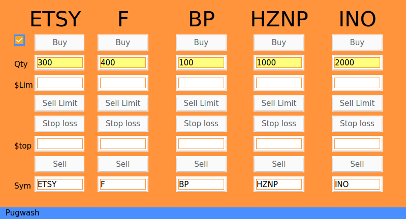
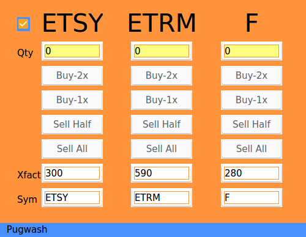
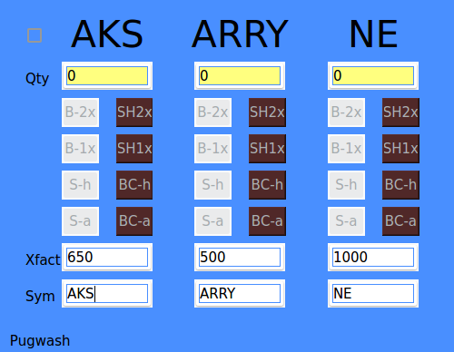

# Etrade HotKeys

The motivation for this project was to allow Etrade buys and sells to be made more quickly than is possible using the tools built into etradePro. This is achieved by eliminating the "Preview" step and "Cancelled due to timeout" that occurs in etradePro if you leave the preview open too long before placing your trade. THIS MAKES HOTKEYS A VERY DANGEROUS TOOL TO USE IF YOU MAKE A MISTAKE WHEN CLICKING "BUY" OR "SELL". Be sure you really intend to place the trade before clicking any button.

**Update** - this project now has two available user interfaces, the original 'hkeys' described below, and a more advanced 'ahkeys' option that is targeted at active trading, where positions may be accumulated and closed out at various times.

## Standard 'hkeys' layout:


## Advanced 'ahkeys' layout:


## Advanced 'ashkeys' layout with Short Sale keys:


This layout has long buy/sell buttons on the left of each ticker group, and short sell / buy to cover buttons on the right.Al

All transaction-open operations (buy, and sell-short) are based on multiples of the Xfact value, which is calculated from a nominal order value (currently hardcoded in e-keys.py), and transaction-close operations (sell, and buy-to-close) work on either the full open quantity, or half the open quantity. The quantity that can be bought using the nominal order value is calculated **when you type a space character at the end of the ticker symbol**. This is a nasty temporary workaround to avoid multiple quote requests before the full ticker is entered.

Currently, the layout is selected by editing the class definition for EtradeApp in e-keys.py.

## Description

There is a checkbox in the leftmost column of the tool panel that globally disables or enables all of the buy and sell buttons. The buttons are disabled when the panel opens, and must be armed by clicking in the checkbox before any trades can be placed. I recommend leaving the panel disarmed at all times unless you intend to make a trade.

This project uses a substantial amount of code from etradePythonAPI (there appear to be two separate identical projects for this on GitHub, I'm not sure whose is the original).

I stripped out the virtual screen and login scraping code from etradePythonAPI & replaced it with a simple browser launcher & raw_input for entering the etrade verification code on the command line.

The frontend is designed using the QT4 Designer utility, then converted to python using:
```
pyuic4 hkeys.ui > hkeys.py
```

The panel as designed allows you to work with five different stocks, with inputs and buttons arranged in a column for each stock. Enter the ticker symbol in the input at the bottom of the column, do not press <return> or <tab>.

This panel is primarily for day trading, so you would normally just enter the quantity in the Qty input (highlighted in yellow) and use the Buy and Sell buttons to place trades.

It is also possible to place Limit Sell orders - place your target price in the $Lim inputs, and click the "Sell Limit" button to place the trade.

Likewise, it is possible to place Stop loss orders, but these are the very simple "Stop on quote" orders, not the trailing stop order types, which are not available in the Etrade REST api. Place the price at which you would want the sell order to be triggered in the $top input. A sale will be triggered when the price falls to that level.

This software uses the Etrade REST api to place orders, the order is then processed and executed on Etrade's servers.

You will need to apply for an individual consumer key via a secure communication to Etrade Customer Service. You will be issued with a pair of sandbox keys initially, which will allow you to check that the software is installed correctly, then after you complete & return some API access agreements you will recieve keys that will allow you to connect to the live server.

Be aware that when you place test orders on the sandbox server, you will recieve back nonsense order confirmations that will be of the correct type, but for random stock ticker names, prices, and quantities. This is to be expected.

The sandbox and production keys can be placed directly into etrade_settings.py, but if you're likely to share the code or put it into a public repository, it is probably better to put the keys into your .bashrc file (or similar depending on your OS) so that they can be read by the program without being part of the codebase:
```
export ETRADE_SANDBOX_KEY='xxxxxxxxxxxxxxxxxxxxxxxxxxxxxxxx'
export ETRADE_SANDBOX_SECRET='xxxxxxxxxxxxxxxxxxxxxxxxxxxxxxxx'
export ETRADE_PRODUCTION_KEY='xxxxxxxxxxxxxxxxxxxxxxxxxxxxxxxx'
export ETRADE_PRODUCTION_SECRET='xxxxxxxxxxxxxxxxxxxxxxxxxxxxxxxx'
```

THIS SOFTWARE DOES NOT COME WITH ANY WARRANTIES WHATSOEVER. USE AT YOUR OWN RISK
